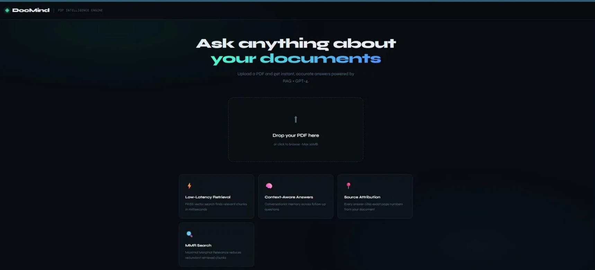

# 🤖 DocMind — Advanced PDF RAG Assistant

An intelligent document Q&A system built with a production-grade RAG pipeline. Upload any PDF and ask questions in natural language — the system retrieves relevant context and generates accurate, cited answers in under 2 seconds.



---

## 🏗️ Architecture

```
User Query
      ↓
IntentClassifierAgent
(fact / summary / comparison / explanation)
      ↓
Hybrid Retrieval
FAISS Semantic Search + BM25 Keyword Search
      ↓
SectionBooster
(prioritizes HIGHLIGHTS, FINANCIAL SUMMARY, OUTLOOK)
      ↓
TableContextProcessor
(injects column labels for financial tables)
      ↓
Groq LLaMA-3.1-8b-instant
      ↓
Answer + Page Citations
```

---

## 📸 Screenshots

### Upload & Processing


### Chat Interface with Source Attribution


---

## ✨ Key Features

### 🧠 Intent Classifier Agent
Automatically classifies every question before retrieval:

| Intent | Example | top_k |
|--------|---------|-------|
| `fact` | "What was revenue?" | 10+8 |
| `summary` | "Summarize highlights" | 18+12 |
| `comparison` | "Compare Q1 vs Q2" | 14+10 |
| `explanation` | "What is Robotaxi strategy?" | 10+6 |

### 🔍 Hybrid Retrieval (BM25 + FAISS)
- **FAISS** — semantic vector search using HuggingFace `all-MiniLM-L6-v2` embeddings (free, local)
- **BM25** — keyword search built from scratch in pure Python (no extra dependency)
- Results merged and deduplicated for maximum recall

### 📄 Section-Aware Chunking
- Detects ALL CAPS headers (`FINANCIAL SUMMARY`, `OUTLOOK`, `CORE TECHNOLOGY`)
- Chunks by section boundaries — keeps tables and related content together
- Every chunk tagged with `section` metadata for filtering

### 📊 Table Context Processing
- Injects explicit column labels into financial table chunks
- Tells LLM: `Col1=Q2-2024 | Col2=Q3-2024 | Col3=Q4-2024 | Col4=Q1-2025 | Col5=Q2-2025`
- Prevents number mix-ups in multi-quarter financial reports

### 🚀 Section Boosting
- Re-ranks chunks for summary queries
- HIGHLIGHTS, FINANCIAL SUMMARY → front of context
- Legal disclaimers → back of context

### 💬 Conversational Memory
- Remembers last 5 Q&A turns per session
- Supports natural follow-up questions

### 📎 Source Attribution
- Every answer includes exact page numbers and section names
- Collapsible source previews in the UI

---

## 🛠️ Tech Stack

| Layer | Technology |
|-------|-----------|
| Frontend | React 18 |
| Backend | FastAPI + Python 3.11 |
| LLM | Groq API — LLaMA-3.1-8b-instant (Free) |
| Embeddings | HuggingFace all-MiniLM-L6-v2 (Free, Local CPU) |
| Vector Store | FAISS (in-memory) |
| Keyword Search | BM25 (custom pure-Python implementation) |
| PDF Parsing | LangChain PyPDFLoader |
| Orchestration | LangChain 0.3 |

---

## 🚀 Quick Start

### Prerequisites
- Python 3.11+
- Node.js 18+
- Free Groq API key → https://console.groq.com

### Backend
```bash
cd backend
python -m venv venv
venv\Scripts\activate        # Windows
pip install -r requirements.txt
```

Create `backend/.env`:
```
GROQ_API_KEY=your_groq_api_key_here
```

```bash
uvicorn main:app --reload --port 8000
```

### Frontend
```bash
cd frontend
npm install
npm start
```

Open → http://localhost:3000

---

## 📁 Project Structure

```
rag-assistant/
├── backend/
│   ├── main.py           # FastAPI REST API
│   ├── rag_engine.py     # Full RAG pipeline (6 components)
│   └── requirements.txt
├── frontend/
│   ├── src/
│   │   ├── App.js        # React UI
│   │   └── App.css
│   └── package.json
├── homepage.jpg
├── processingimage.jpg
├── questionans image.jpg
└── README.md
```

---

## 🔌 API Endpoints

| Method | Endpoint | Description |
|--------|----------|-------------|
| `POST` | `/upload` | Upload PDF, returns session_id |
| `POST` | `/chat` | Ask question, get answer + sources |
| `GET` | `/session/{id}` | Session info |
| `DELETE` | `/session/{id}` | Delete session |
| `GET` | `/health` | Health check |

---

## 🔮 Production Roadmap

| Current | Production Upgrade |
|---------|-------------------|
| FAISS in-memory | Pinecone / Weaviate |
| Dict session store | Redis |
| Local PDF storage | AWS S3 |
| No reranking | BGE cross-encoder reranker |
| No evaluation | RAGAS evaluation framework |
| Single PDF | Multi-document corpus |

---

## 💡 Example Queries

```
"What was Tesla's GAAP operating income in Q2 2025?"
→ Intent: fact | Answer: $923M (p.24)

"Compare Q1 2025 vs Q2 2025 total revenue"
→ Intent: comparison | Answer: $19,335M vs $22,496M (+16.3% QoQ)

"What is Tesla's Robotaxi strategy?"
→ Intent: explanation | Detailed answer with sources

"Summarize the key financial highlights"
→ Intent: summary | Structured answer with all metrics
```

---

## 👩‍💻 Author

**Palak Tiwari**
GitHub: [@palak0607](https://github.com/palak0607)
